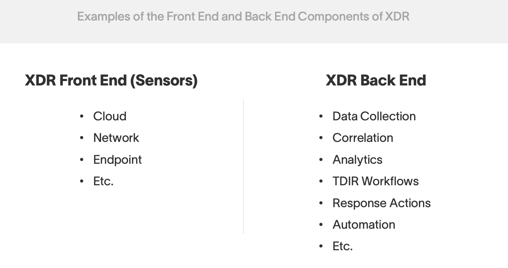
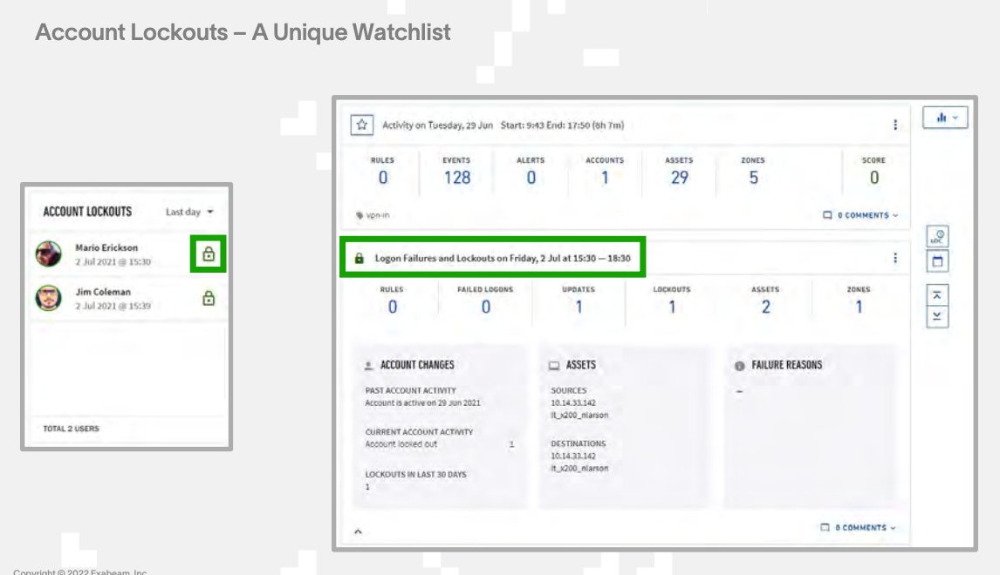

# Exabeam_TDIR_Training

# Exabeam TDIR for Security Analysts (EDU-2170

## Table of contents

1. [Introduction for Advanced Analytics](#introduction1)
    1. [Slides](#slides)
    2. [All Links](#alllinks)
    3. [Key Takeaways](#keytakeaways)
    4. [Types of Attacks](#subparagraph4)

2. [Module 2: Threat Detection with Behavior Analytics](#threatdetection)
    1. [How User Entity Behavioral Analytics (UEBA) Works](#ueba)
    2. [Lab](#module2lab)
    3. [XDR](#xdr)

3. [Module 3: How data Ingestion and Enrichment works in AA](#module3)
    1. [Data Flow in AA](#module3-sub1)
    2. [Log Types](#module3-sub2)
    3. [Enrich Events Stages](#module3-sub3)

4. [Module 4: Smart Timeline](#module4)
    1. [Zero Days](#zero-day)
    2. [Sessions](#sessions)
    3. [Histograms](#histogram)
    4. [Smart Timelines](#smart-timelines)
    5. [Lab](#module4-lab)
   
5. [Module 5: Threat Hunting with AA](#module5)
    1. [MITRE ATT&CK](#MITRE)
    2. [Threat Hunter](#Threat-Hunter)
    3. [Data Insights](#Data-Insights)
    4. [Watchlists](#watchlists)
    5. [Lab](#module5-lab) 
  
6. [Module 6: Investigate and Respond with Case Manager and Incident Responder](#module6)
    1. [Case Manager checklist](#CaseManagerchecklist)
    2. [Turnkey Playbook](#turnkeyplaybook)

# Introduction Data Lake for Security Analysts 

Purpose of the Course: 
- Help analysts use daily the Exabeam Security Operations Platform to detect, investigate, and respond to threats with rapid time to value, out-of-the-box integration, and pre-tuned detection mechanisms

1. Recall how Exabeam empowers security teams:
- Rapid time to value
- Out-of-the-box integration
- Pre-tuned detection mechanisms

## Lab Setup
[ LINK: Customer Login](https://customer.exabeamtraining.com/)
- My Profile
- Click on Class currently Enrolled in 
- All Slides/Labs will be there

## Slides  

[ LINK: Day 1 Slides](./assets/Day1-2170-Student-v4.pdf)

[ LINK: Day 2 Slides](./assets/Day2-2170-Student-v4.pdf)

[ LINK: Day 3 Slides](./assets/Day3-2170-Student-v4.pdf)

## Links 

[ LINK: Library - Amazing Sources - Discover more about the Exabeam platform, learn about the latest in SecOps, and find resources to help mature your SOC. Browse by content type or explore our featured picks below.](https://www.exabeam.com/library/)

[ LINK: Customer Login](https://customer.exabeamtraining.com/)

[ LINK: All Documentation](https://docs.exabeam.com/)

[ LINK: Advanced Analytics User Guide](https://docs.exabeam.com/cloud-delivered-advanced-analytics)

[ LINK: Office Hours](https://community.exabeam.com/s/article/Exabeam-SaaS-Cloud-Office-Hours)

[ LINK: Virtual Instructor Led Training](https://customer.exabeamtraining.com/page/instructor-led-training)

[ LINK: Digital Learning](https://customer.exabeamtraining.com/page/digital-learning)

[ LINK: Exabeam CTF](https://customer.exabeamtraining.com/exabeam-capture-the-flag)

[ LINK: Mitre Systems Engineering](https://www.mitre.org/our-impact/mitre-labs/systems-engineering-innovation-center)

[ LINK: Elimate Alert Fatigue](https://alertops.com/eliminate-alert-fatigue/)

[ LINK: What is XDR](https://www.exabeam.com/information-security/what-is-xdr-transforming-threat-detection-and-response/)

## Key Takeaways 

### Takeaway #1 - Adop a Use Case Methodology 

### Takeaway #2 - Known How Behavior Analytics Work

### Key Takeaway #3: Utilize the Exabeam Security Operations Platform for Investigation and Response Workflows

 

## Types of Attacks 

- Insider Threat
  - An exisitng employee or contractor exploits thier access for malicoius purposes 

- Lateral/Parallel Movement

- Compromised Insider
  - Credentials exploited by someone outside the organization for the purpose of data theft and/or sabotage

## Module 2 Threat Detection with Behavior Analytics  

**1. Security Alerts**

  - Security Alerts have many ways of being noticed – directly through consoles and notifications or indirectly through a SIEM or a tool like Exabeam Alert Triage
  - 3rd party products issues theirn own alerts 

**2. Fact-Based Rules**

  - Conditional logic applied to log data in Advanced Analytics that identifies patterns associated with unwanted or risky activity
  - Fact-based rules are often referred to as correlation rules in a traditional SIEM. Fact-based rules are
applied to unwanted activities, risky activities, or even undesired activities, but not necessarily limited
to malicious events or behavior.

**3. Behavior Analytics**

  - Machine learning applied to data that generates risk scores based on anomalies
  
  - Behavior Analytics is a unique way of detecting threats because it does not look for a specific recognizable process or pattern – rather it relies on data modeling to determine normal activity and then triggers anomalies and assigns risk based on these deviations from normal.

### Alert Fatigue = Risk

- Some tools generate more alerts than others (e.g., DLP)
 
- Analysts can be overwhelmed by alerts and affected by bias

- Missed alerts and false positives cost organizations time and money

- When asked to identify their top incident response challenges, 36% of the cybersecurity professionals
surveyed said, “keeping up with the volume of security alerts.”

- 42% of cybersecurity professionals say that their organization ignores a significant number of security
alerts because they can’t keep up with the volume.

- When asked to estimate the percentage of security alerts ignored at their organization, 34% say
between 26% and 50%, 20% of cybersecurity professionals say their organization ignores between 50%
and 75% of security alerts, and 11% say their organization ignores more than 75% of security alerts. Mama Mia, that’s a lot of security alerts left on the cutting room floor.

### How Anomalies Help SOCs

- Adding anomaly detection improves visibility and alert fidelity
- Combining anomaly detection with security alerts focuses analyst effort

- Anomaly detection improves detection and increases alert fidelity by showing risky behavior in and around
events. Context and meaning are added to third party alerts and focuses analysts allowing them to make
critical security decisions.

### How User Entity Behavioral Analytics (UEBA) Works 

- UEBA solutions are based on a concept called baselining. They build profiles that model standard behavior for users, hosts, and devices (called entities) in an IT environment.

- Using primarily machine learning techniques, they identify activity that is anomalous, compared to the established baselines, and detect security incidents. The primary advantage of UEBA over traditional security solutions is that it can detect unknown or elusive threats, such as zero-day attacks and insider threats. In addition, UEBA reduces the number of false positives because it adapts and learns actual system behavior, rather than relying on predetermined rules which may not be relevant in the current context.

#### Another term that is sometimes used in conjunction with UEBA is next-generation SIEM. In Gartner’s vision of a nextgeneration SIEM solution, a SIEM should include built-in UEBA functionality. The report lists the following as critical capabilities of a modern SIEM:
- User monitoring, including baselining and advanced analytics to analyze access and authentication data, establish
user context, and report on suspicious behavior.
-  Advanced analytics – applying sophisticated statistical and quantitative models, such as machine learning and deep learning, on security log and event data to detect anomalous activity. Advanced analytics should complement the traditional rule and correlation-based analytics available in traditional SIEMs. 

#### Advanced analytics, which is the hallmark of UEBA tools, involves several modern technologies that can help identify abnormal behavior even in the absence of known patterns:
-  Supervised machine learning – sets of known good behavior and known bad behavior are fed into the system. The tool learns to analyze new behavior and determine if it is “similar to” the known good or known bad behavior set.
- Bayesian networks – can combine supervised machine learning and rules to create behavioral profiles.
- Unsupervised learning – the system learns normal behavior and is able to detect and alert on abnormal behavior. It
will not be able to tell if the abnormal behavior is good or bad, only that it deviates from normal.
- Reinforced / semi-supervised machine learning – a hybrid model where the basis is unsupervised learning, and actual alert resolutions are fed back into the system to allow fine tuning of the model and reduce the signal-tonoise ratio. 
- Deep learning – enables virtual alert triage and investigation. The system trains on data sets representing security alerts and their triage outcomes, performs self-identification of features, and is able to predict triage outcomes for new sets of security alerts.

### Module 2 Lab 

[ LINK: Lab Login](https://classroom9-aa.exalabs.io/)

### What is XDR eXtended Detection and Response 

- What is a native XDR?
  - A native XDR is a closed ecosystem that offers both the front-end solutions that generate data as well as the back-end capabilities of analysis and workflow. To be a native XDR solution, a vendor should ideally offer all required sensors needed for common XDR use cases, typically endpoint, network, cloud, identity, email, etc. as well as a back end capable of performing threat detection, investigation, and response with that data. Native XDR vendors can be EDR vendors who are expanding their portfolio to include more sensors and back-end capabilities such as efficient advanced analytics, or they can be platform vendors which have a wide portfolio of security tools that they are trying to more tightly integrate to provide XDR-like functionalities.
- What is an open XDR?
  - Alternatively, open XDR vendors offer a solution that is predominantly focused on the back-end analytics and workflow engine. Leading open XDR vendors also add prescriptive content required across all the phases and the full lifecycle of threat detection, investigation and response (TDIR) to easily solve common SOC use cases out of the box. - Open XDRs need to integrate with all of an organization’s existing security and IT infrastructure, then correlate and analyze all relevant data, and finally automate and optimize TDIR workflows, making it easier for SOC teams to respond to incidents quicker. As security stacks have grown more complex and disjointed in organizations, open XDRs act as a single control plane across multiple products and vendors. This provides visibility and allows orchestration and automation of actions (similar to SIEM and SOAR functionality) so that SOC teams don’t have to run manual workflows across a myriad of tools.

- Exabeam’s take on XDR
  - We believe the open XDR approach best positions most security teams for success and reduces their cybersecurity risks. While the native approach may, in theory, offer the major pieces of a security program and the simplicity of a single vendor, we believe this will inevitably lead to vendor lock-in and a lack of depth and breadth of coverage for organizations. Security teams will find it difficult to get best-in-class capabilities across email, DLP, identity, cloud all from a single vendor.
In addition, organizations selecting a native XDR may find it very difficult to add a security tool from another vendor that covers a new attack vector or more advanced threats. Because native XDRs are usually focused on their own portfolio, little to no capabilities and support exist to efficiently integrate with sensors from other infosec tools. The flexibility offered by an open XDR allows security teams to keep existing investments in best-of-breed security tools while allowing desired changes to their tech stack. Open XDRs are made to integrate with other products — so they can comprehensi 

- XDR is a set of technologies that can help security teams perform more effective threat detection, as well as rapid investigation and response.
- Unlike previous-generation security solutions, XDR is not limited to one security silo — it combines data from networks, endpoints, email, IoT devices, servers, cloud workloads, and identity systems. It combines data from all layers of the IT environment, and enriches them with threat intelligence, to detect sophisticated and evasive threats.
- A primary value of XDR is that it provides prepackaged, automated threat detection, investigation and
response (TDIR) for a variety of threats. XDR solutions are cloud delivered, suited for distributed,
heterogeneous IT environments. They are turn-key solutions that immediately provide value and improve
productivity for security teams.

- XDR is typically made up of three major feature sets: front end, back end and content. The front end consists of the “sensors” that generate security telemetry data, like CASBs, EDRs, IAM, DLP solutions, and others. The back end ingests all the collected telemetry data, logs and context information, then conducts all the data correlation, advanced analytics, threat detection, investigation, tool orchestration, and response automation.
- The third critical component of any successful XDR is content. XDRs should be able to offer a closed-loop
solution that encompasses the entire security operations workflows of threats. XDRs are supposed to be
turnkey solutions with immediate time to value and minimum/no configuration, regardless of the expertise
level of the SOC — so instead of tuning, SOCs should be able to use XDRs to address immediate concerns
from start to finish. By this, we mean focusing on one use case and expanding from thereafter each one is
addressed. Without this capability, XDRs will not be able to fulfill their value prop: turn-key TDIR that works immediately, without customization.
- Without prescriptive, prepackaged content that ties these pieces together around specific use cases, it’s
impossible to achieve the value props of simplicity, automation, and successful outcomes that XDR promises.

## Module 3 How Data Ingestion and Enrichment Works in AA 

### 1. Identify the stages of the data flow in Advanced Analytics 

- In order to identify risky behavior from normal data Advanced Analytics uses several different processing
engines to massage the mountain of raw data.

### 2 Log Types 

- Describe log types and log considerations ; and recall the two stages of the Log Ingestion engine:
    1. Parse Logs
    2. Create Events

INFRASTRUCTURE LOGS – Server logs, firewall logs, system health logs. These are not as useful as the other types of logs but can be ingested for certain use cases. Infrastructure logs are also helpful for enriching context.

ACTIVITY LOGS – These are essential to UEBA analytics and context setting.

SECURITY LOGS – Traditional alerting and alarm systems like firewalls, proxies, endpoint, etc. These are valuable to Advanced Analytics. 

Example Log Sources:
-  Network Security, firewall, monitoring & forensics, IDS, UTM
-  Endpoint Security, prevention, detection and response
-  Application Security, WAF and Vulnerability Assessment
-  Web Security
-  Messaging Security
-  Risk & Compliance
-  Security Ops and Incident Response
-  Data Security
-  Mobile Security
-  IAM
-  Threat Analysis and Protection
-  Fraud Prevention & Transaction Security

#### The Advanced Analytics Ingestion Engine performs the following:

-  Typically ingests most logs via Syslog, maximizing local processing efficiency since Advanced Analytics is
not adding a processing workload.
-  In some cases, API can be configured to fetches logs from SIEM log repositories such as Splunk and
Qradar (with infrastructure prerequisites)
-  Normalizes raw logs into an internally consistent event format used for the rest of the pipeline.

- The Ingestion Engine of Advanced Analytics is going to process log data obtained directly through Syslog or
through a SIEM API connected to such as Exabeam Data Lake, Splunk, Microfocus ArcSight, and many more.
Different sources may identify fields of data differently, so raw log items are normalized so that there are consistent field names and types for common pieces of information such usernames, hostnames, or source IP addresses.

- Different types of data are needed if your goal is to track compromised credentials than phishing or
malware. Identifying who and where are the sources of greatest risk because of likelihood and
value will help you identify the logs that surround those resources or people. Having the logs that
accomplish those goals without weighing down Advanced Analytics with the job of working through
data sources that are irrelevant is crucial for an environment that provides relevant data in a timely
way.

[LINK: Story cloud data](https://www.exabeam.com/information-security/cloud-source-code-theft/)

### 3. Enrich Events Stages 

 - Describe the two types of the Enrich Events stage in the Analytics Engine:

    1. System-Defined
    2. User-Defined

#### Analytics Engine Tasks:
-  Enriches the events with contextual data
-  Build sessions out of user and entity activity.
-  Models analyze the events for machine-learning.
-  Evaluate this activity using rules to trigger against anomalous, abnormal events and assign risk scores.
-  Build Smart Timelines, showing normal and abnormal activity chronologically.

There are two types of enrichment, system- and user-defined:
- SYSTEM-DEFINED
  - This type of enrichment is done automatically by Advanced Analytics in the backend and can be slightly tuned by custom_exabeam_config.conf.
  
  - Host-IP Mapping – If a user or hostname is detected without the other, this enrichment feature populates the missing field based on previously seen data.
  
  - Security/DLP-Alerts-to-User Mapping – When security or DLP alerts do not have the user information, this enrichment feature populates the user field based on previously seen data.

- USER-DEFINED
  - This type of enrichment can be granularly controlled by the user.
  - Context Enrichment – Performs a lookup from a context table to populate a field. 
  - Event Enrichment – Modifies/adds/removes fields. This is the most common type of enrichment, defined the same way context enrichment is defined. All logical expressions available in the analytics engine, excluding model/session expressions, can be used in the Event Enricher.
  - Event Duplicator – Duplicates an event for the purpose of adding to a different user/asset timeline.

#### Answer the following key questions regarding context:

    1. Where does context come from?
  - What is Context? Context provides additional details, thus enabling analysts to make deductions, determine intent, and infer other relevant insights during an investigation. Context can come from multiple sources, including context tables
    2. How are context tables used in behavior analytics?

**Context provides additional details, thus enabling analysts to make deductions, determine intent, and infer other relevant insights during an investigation.**

- Context comes from multiple sources. The analytics engine can produce context with things like Risk
Score, the Smart Timeline, and Dynamic Peer Grouping. Context data can also come from context tables.
Context tables are lists of resources. 

- For example, these resources can range from assets (i.e., computers,
servers) or users (employees of the company) to a list of IPs and Internet domains. While logs show what
users and entities are doing, context tables can provide context by showing who the users and entities are.
Some context tables come out-of-the-box. Others can be created and managed by administrators.

### References:

https://docs.exabeam.com/en/advanced-analytics/i56/advanced-analytics-administration-guide/125371-
configure-advanced-analytics.html#UUID-c64778c2-4af7-96fd-8ea6-7a43aa7c9d8e

https://docs.exabeam.com/en/advanced-analytics/i56/advanced-analytics-administration-guide/125371-
configure-advanced-analytics.html#UUID-c64778c2-4af7-96fd-8ea6-7a43aa7c9d8e

https://community.exabeam.com/s/article/Context-Tables

Context tables enrich the logs by fusing multiples sources containing additional details into the Exabeam SOC
Platform, thus adding context. Context tables may also be used by rules and watchlists.
How are context tables used in analytics?

Two ways:
- Enrich logs to help with the anomaly detection process
- Used directly by the risk engine layer for many rules

Context tables may also be used to populate key fields in the User Profile and Asset pages.
An example of when context tables could be used is when you want to customize rules and models that are in
AA. You can create a list of specific users and have a rule that will check if an event is related to one of the
users listed in that context table.

- Administrators can view and edit Exabeam's out-of-the-box context tables as well as create their own custom
tables. They can select a specific table, such as Executive Users, Service Accounts, etc. and see the details of
the table and all of the objects within the table. Edits can be performed on objects individually or through
CSV uploads. 

 Source
  - https://community.exabeam.com/s/article/Context-Tables
  - https://docs.exabeam.com/en/advanced-analytics/cloud-delivered/advanced-analytics-administrationguide/127389-configure-advanced-analytics.html

The Exabeam Threat Intelligence Service delivers a constant stream of up-to-date threat indicators
to Advanced Analytics deployments. Data Lake customers can also leverage these indicators by filtering
searches using key-only context tables.

The categories of indicators affected are the following:

• IP addresses associated with Ransomware or Malware attacks

• IP addresses associated with the TOR network

• Domain names associated with Ransomware, Phishing, or Malware attacks

Indicators are downloaded by the Exabeam SOC platform from Threat Intelligence Service on a daily basis.
Advanced Analytics and Data Lake connect to Threat Intelligence Service through a cloud connector service
that provides authentication and establishes a secure connection to Threat Intelligence Service. The cloud
connector service then collects updated threat indicators from Threat Intelligence Service daily.
These indicators are then made available within Advanced Analytics to provide enhanced risk scoring based
on curated threat intelligence.
This product does not require a separate license. 

Context tables are stored in Advanced Analytics in order to map to user profile fields and enrich events,
models, and rules using the most up to date contextual information. Some tables can be automatically
populated. For example, many tables can be populated automatically from Active Directory. Some tables
must be manually populated. Custom tables can also be created to create watchlists or reference lists for
assets, threat intelligence indicators, or users and groups that don’t fit in typical deployment categories.

Threat Intelligence feeds can also populate context tables. In this example, a table of IP addresses in
“is_ransomware_ip” context table and can be used to trigger ransomware rules. 

The small group icon identifies which element in the directory information has been defined as the peer
group.

The peer group icon is next to the manager’s department.
Exabeam works with each organization to create its definition of a peer group.
Clicking on the Peer Group link opens a popup with the highest-scoring sessions for members of the peer
group.

If dynamic peer grouping is enabled, we display the strongest relationship group.

**References**

https://www.exabeam.com/ueba/who-do-i-belong-to-dynamic-peer-analysis-for-ueba-explained/

https://docs.exabeam.com/en/advanced-analytics/cloud-delivered/advanced-analytics-user-guide/153664-
get-to-know-a-user-profile.html

https://docs.exabeam.com/en/advanced-analytics/i56/advanced-analytics-administration-guide/125371-
configure-advanced-analytics.html#UUID-471e24ff-903c-5af6-6901-21f028485ad9

https://community.exabeam.com/s/article/Dynamic-Multi-Peer-Groups

### Peer Grouping 

With dynamic peer grouping enabled, Advanced Analytics automatically determines the best possible peer
group(s) for a user based on their activities. 

This allows for more accurate analysis and scoring of anomalies across multiple peer groups. With multi-peer grouping enabled, each user in an organization can belong to multiple peer groups.

The groups can be any group in Active Directory. With multi-peer grouping turned off, users will belong to the peer group they are assigned in Active Directory. On the user page, Advanced

Analytics displays all the peer groups for each user along with the degree of membership of the user to the groups; this appears in the form of a word cloud.

Peer group anomalies for a user session could be triggered due to anomalous behaviors across one or more
peer groups.

The risk score of a specific peer group rule within a session is aggregated on the risk reasons and
the timeline page. 

The analyst can select a peer group based triggered rule, expand and get additional details
on the possible peer groups, the degree of membership for each group and a visual indication of which peer
groups generated anomalies.

 On a specific triggered rule, the analyst can see the histograms for all peer
groups.

 When dynamic peer grouping is disabled, Advanced Analytics leverages existing static single peer
group selection (such as Department, Division, Manager, Title etc.).

 NOTE Please read the knowledge base
article titled Dynamic Multi-Peer Group Scoring for more detailed information on dynamic peer grouping as
well as configuration information.

#### Where does context come from:

Context comes from multiple sources.

The analytics engine can produce context with things like Risk
Score, the Smart Timeline, and Dynamic Peer Grouping.

 Context data can also come from context tables.
Context tables are lists of resources.

 For example, these resources can range from assets (i.e., computers,
servers) or users (employees of the company) to a list of IPs and Internet domains. While logs show what
users and entities are doing, context tables can provide context by showing who the users and entities are.
Some context tables come out-of-the-box. Others can be created and managed by administrators

## Module 4 How the Smart Timeline™ is Created in Advanced Analytics 

#### Are zero-day threats worth spending time on? 

Zero-day attacks are difficult to detect, and many legacy security tools miss them, especially tools that are based on
signatures. Because of this, some may think its silly to waste hours on zero days. However, some industries and regions
spend a lot of time on zero days because they either have the expertise or do not have any risk tolerance. Because
Advanced Analytics is focused on anomalies rather than alerts, it helps detect zero-days and unknown malware. Here are
10 ways that Advanced Analytics can help your organization, including against zero-day and unknown attacks:

1.Block attacks – Advanced Analytics provides AI-based analysis and behavioral threat protection that can help stop known
and unknown attacks, including exploits, malware and fileless attacks.

2.Gain visibility – Advanced Analytics collects and correlates data across networks, endpoints, and cloud environments and
applies it to detection, triaging, investigating, hunting and threat response processes.

3.24/7 automated detection – Advanced Analytics continuously applies AI-based analytics as well as custom rules that help
detect advanced persistent threats (APTs) as well as any other covert attack such as lateral movement, malicious insiders,
compromised insiders, etc.

4.Prevent alert fatigue – Advanced Analytics uses automated root cause analysis alongside a unified incident engine to
triage alerts and dramatically reduce alerts. This can help prevent alert fatigue, avoid personnel turnover, and streamline
incident response.

5.Increase SOC productivity – Advanced Analytics helps consolidate security policy management as well as monitoring,
investigations and response across networks, endpoints and clouds into one console.
6.Eradicate threats – Advanced Analytics enables teams to shut down attacks with surgical precision without causing
business disruption.

7.Eliminate advanced threats – Advanced Analytics can help protect the corporate network against malicious insiders,
compromised insiders, external threats, policy violations, ransomware, advanced zero-day malware, and fileless and
memory-only attacks.

8.Improve your security team – Advanced Analytics can help detect indicators of compromise (IOCs) as well as anomalous
behavior. It can also prioritize analysis using incident scoring. This can help disrupt all stages of an attack

9.Restore hosts to a clean state – Advanced Analytics can provide remediation suggestions to help you quickly recover
from an attack. For example, how to remove malicious files and registry keys, and how to restore damaged files and registry
keys.

10. Analyze third party-data sources – Advanced Analytics enables you to extend detection, investigation and
response to external sources. For example, performing behavioral analytics on logs collected from third-party
firewalls.

Source

https://www.exabeam.com/information-security/Advanced Analytics-security-10-ways-Advanced Analyticsenhances-your-security-posture/

#### Sessions 

1. Answer theses:
    1. What is a “session” in Advanced Analytics?

    2. What triggers the start/stop of a session in Advanced
    Analytics?

Sessions are the buckets in which events are stitched together to form a coherent picture. Sessions are built
for each user that has discovered events and for each entity (based on IP and host identifiers).
Sessions include stateful user tracking and entity tracking to weave into coherent timelines for investigation
and context.

“Security log data is stateless…a platform must be able to piece events together to track the state of data,
and ultimately, a user’s behavior.” -Derek Lin, Exabeam Chief Data Scientist

Source

https://www.exabeam.com/ueba/data-science-and-stateful-user-tracking-the-two-key-uba-enablers/
More information

https://www.exabeam.com/ueba/data-science-and-stateful-user-tracking-the-two-key-uba-enablers/

User Session represents all the events that Exabeam attributes to an individual user in a timeframe (after 5 hours of
user inactivity or 24 hours of maximum duration, Exabeam closes the user session). Typically, user sessions are one
day of activity, but there can be multiple user sessions in a day. Exabeam collects event logs that relate to the user’s
assets and activities and defines these as a logical user session.

Asset Session represents all the events that Exabeam attributes to an individual asset in a timeframe. Asset Sessions
are similar to User Sessions in that they are a logical container of event logs related to the asset's activities, however
an Asset Session lasts for one 24-hour period, from midnight UTC to midnight UTC.

Event data from one or more sources are parsed into events, enriched, and then grouped into sessions.
Sessions are a bucket used to hold common events that belong together because they represent a day or
activities followed by a five-hour period of inactivity. 

    When viewing a Smart Timeline in Advanced Analytics analysts want to be able to see information in a way
that is organized in an easy to understand calendar like format. To define that format the analytics engine
uses sessions.

#### Histograms 

2. Explain the three types of models and how they differ from
one another; and view a “histogram” in Advanced Analytics.

**Models are the mathematical key to User And Entity Behavior Analytics (UEBA)**

Advanced Analytics uses predictive analytics models. By gathering data from the past, it can be guessed as to
what can be expected in the future. 

Models determine what captured event data to observe. Machine learning is trained to determine the unique
“normal” of the logged data at multiple levels, including, users, assets, groups, and organization wide.

We will look at the three types of models that are used by Advanced Analytics to create histograms of data.
Definitions of Model Types:

Categorical is the most common. It models a string with significance: number, host name, username, etc.
Where numbers fall into specific categories which cannot be quantified. When you model which host a user
logs into, it is a categorical model.

Numerical Clustered involves numbers that have meaning – it builds clusters around a user’s common
activities so you can easily see when the user deviates from this norm. For example, you can model how
many hosts a user normally accesses in a session.

Numerical Time-of-Week models when users log into their machines in a 24-hour period. It models time as a
cycle so that the beginning and end of the period are close together, rather than far apart. For example, if a
user logs into a machine Sunday at 11:00 pm, it is closely modeled to Monday at 12:00am.

Reference

https://docs.exabeam.com/en/advanced-analytics/i56/advanced-analytics-administration-guide/125371-
configure-advanced-analytics.html#UUID-aa5d6f0f-544d-2681-b8b9-2649f4011948

Numerical Time-of-Week 

models when users log into their machines in a 24-hour period. It models time as a
cycle so that the beginning and end of the period are close together, rather than far apart. For example, if a
user logs into a machine Sunday at 11:00 pm, it is closely modeled to Monday at 12:00am.

Categorical is the most common. It models a string with significance: number, host name, username, etc.
Where numbers fall into specific categories which cannot be quantified. When you model which host a user
logs into, it is a categorical model.

Numerical Clustered involves numbers that have meaning – it builds clusters around a user’s common
activities so you can easily see when the user deviates from this norm. For example, you can model how
many hosts a user normally accesses in a session.

Since anomaly-based rules depend on models, it is helpful to have a basic understanding of how Exabeam's
models work.

Our anomaly detection relies on statistical profiling of network entity behavior. Our statistical profiling is not
only about user-level data. In fact, Exabeam profiles all network entities, including hosts and machines, and
this extends to applications or processes, as data permits. The statistical profiling is histogram frequency
based. To perform the histogram-based profiling, which requires discrete input, we incorporate a variety of
methods to transform and to condition the data. Probability distributions are modeled using histograms,
which are graphical representations of data. There are three different model types – categorical, numerical
clustered, and numerical time-of-week.

Reference

https://docs.exabeam.com/en/advanced-analytics/i56/advanced-analytics-administration-guide/125371-
configure-advanced-analytics.html#UUID-aa5d6f0f-544d-2681-b8b9-2649f4011948

Levels of convergence for a model based upon trained data is expressed per-scope as a confidence level.

Low = <80%

Fair = 80%-89%

Good = 90%-99%

Excellent = 100%

Remember: LOW confidence only means "We don't have enough Data" for it to be sure!! So, when does the
confidence increase... when we have more data! 

### Training Period

Student Notes

Predictive analysis requires data to be useful. There has to be a baseline in order to compare it with. The
more data the more accurate a model can usually be.

MODEL AGING

Over time, models built in your deployment naturally become outdated. For example, if an employee moves
to a different department or accepts a promotion and they do not adhere to the same routines, access
points, or other historical regularities.
We automatically clean up and rebuild all models on a regular basis (default is every 16 weeks) to ensure your
models are as accurate and up-to-date as possible. This process also enhances system performance by
cleaning out unused or underutilized models

Histogram definition: A histogram is a visualization of statistical information that uses rectangles to show the
frequency of data items in successive numerical intervals of equal size.
Types of Histograms

Each histogram has one of several possible templates or presentations. This section describes each histogram
type. The presentation types are as follows:

• Table Histogram: presents a list of values and the number of times they were observed.

• Time of Week: shows blocks of time during the day on one axis, plotted against the days of the week.

• Cluster Histogram: uses a bar to represent ranges of values that constitute a cluster of events.

• Map (of the world): which, for example, can show countries from which a VPN session was started.

Histograms can be viewed from Data Insights.

Types of Histograms Each histogram has one of several possible templates or presentations. This section
describes each histogram type. The presentation types are as follows:

• Table Histogram: presents a list of values and the number of times they were observed.

• Time of Week: shows blocks of time during the day on one axis, plotted against the days of the week.

• Cluster Histogram: uses a bar to represent ranges of values that constitute a cluster of events.

• Map (of the world): which, for example, can show countries from which a VPN session was started.

Histograms can be viewed from Data Insights.

3. Compare and contrast model-based rules with fact-based
rules and describe how Risk Scores are assigned.

More Information

https://www.exabeam.com/wp-content/uploads/2018/10/Rules-vs.-Models-in-your-SIEM-WP.pdf

The Exabeam Rules interface in Advanced Analytics has been redesigned to simplify searching, creating, and
modifying rules. Rules are organized by use case and use case scenario—for example, "Abnormal VPN Access"
is a scenario in the "Compromised Credentials" use case. Modules 7, 8, and 9 covers use cases and use case
categories in depth.

By default, only Tier 3 analysts and Administrators have permission to view and manage rules.

References

View rules in Advanced Analytics: https://docs.exabeam.com/en/cloud-delivered-advancedanalytics/all/administration-guide/127389-configure-advanced-analytics.html#UUID-def1b652-3338-e767-
c2ce-0e1fee32e401

Filter rules: https://docs.exabeam.com/en/cloud-delivered-advanced-analytics/all/administrationguide/127389-configure-advanced-analytics.html#UUID-ebce552b-a965-df67-ab52-a8aaded8c96e

TDIR Use Case Packages: https://docs.exabeam.com/en/use-cases/all/get-started-with-tdir-use-casepackages/159617-threat-detection,-investigation,-and-response--tdir--use-case-packages.html#UUIDd069dccf-1743-50f9-8a05-58fa2b624a34
https://community.exabeam.com/s/article/Landing-Page-for-Tuning-Rules-in-Advanced-Analytics

#### 4 Smart Timelines 

4. Navigate the Smart Timeline™ effectively and recall how it is assembled through the analytics engine.

#### Module 4 Labs 

## Module 5: Threat Hunting with AA 
 
 
[LINK: Data Exfil Use Case](https://community.exabeam.com/s/article/Data-Exfiltration-Use-Case-Chapter-5-Investigate)

  
#### MITRE ATT&CK 

1. Navigate the MITRE ATT&CK® Framework and extract information useful to threat hunting

MITRE is an organization 

ATT&CK is a free, open, globally accessible knowledge base of adversary behaviors, an encyclopedia of real-
world observations of what adversaries have been seen to do

Techniques: 266 as of Aug 2019” (source: https://medium.com/mitre-attack/automating-mapping-to-attack-
tram-1bb1b44bda76)

Coming in 2020 (source: https://medium.com/mitre-attack/2020-attack-roadmap-4820d30b38ba)

Sub-techniques will be added. Sub-techniques will help fix the unevenness across the knowledge base as 
some techniques are broad in definition and some specific

#### Examples:

- Lateral movement: Remote Services will be broken out into Remote Desktop, SMB/Windows Admin 
Shares, Distributed Component Object Model, etc.

- Credential Access: Brute Force will be broken out into Password Guessing, Password Cracking, 
Password Spraying, Credential Stuffing

- Adversary behavior model for network infrastructure devices including routers, switches and firewalls
Threat Report ATT&CK Mapper (TRAM) (beta released Dec 2019)

- Provides a streamlined approach for analyzing reports and extracting ATT&CK techniques
Goal: reduce analyst fatigue, increase ATT&CK coverage, improve accuracy of threat intelligence 
mappings

#### Map ATT&CK to NIST 800.53 v4

Goal: better support efforts to identify controls that mitigate relevant threats and identify capability gap

More Information

https://www.mitre.org/capabilities/cybersecurity/overview/cybersecurity-blog/the-philosophy-of-attck

https://www.exabeam.com/information-security/what-is-mitre-attck-an-explainer

MITRE ATT&CK® is a globally-accessible knowledge base of adversary tactics and techniques based on real-world observations of cyberattacks.

•Tactics – the whyof an attack, e.g., Privilege Escalation, Defense Evasion

•Techniques – the howof an attack, e.g., Access Token Manipulation, Clear Command History

•Common Knowledge – the documented use of tactics and techniques by adversaries

•Matrices – the visual organization of Tactics and Techniques for Enterprise, Mobile et al

•Groups – sets of related intrusion activity that are tracked by a common name in the security community,  e.g., APT3 (Gothic Panda from China)

More Information

https://www.exabeam.com/wp-content/uploads/2020/01/Exabeam_Whitepaper_MitreAttack.pdf

https://www.exabeam.com/information-security/what-is-mitre-attck-an-explainer/

#### Threat Hunter 

 2. Use Threat Hunter to unearth hidden threats

 
https://www.exabeam.com/siem/how-to-use-exabeam-for-threat-hunting/
 

Do you have a proactive threat hunting program, and how does it work?

 Threat hunting activities include:

•Hunting for insider threats or outside attackers – Cyber threat hunters can detect threats posed by insiders, 
like an employee, or outsiders, like a criminal organization.

•Proactively hunting for known adversaries – A known attacker is one who is listed in threat intelligence 
services, or whose code pattern is on the deny list of known malicious programs.

•Searching for hidden threats to prevent the attack from happening – Threat hunters analyze the computing 
environment by using constant monitoring. Using behavioral analysis, they can detect anomalies which could 
indicate a threat.

•Executing the incident response plan – When they detect a threat, hunters gather as much information as 
possible before executing the incident response plan to neutralize it. This is used to update the response plan 
and prevent similar attacks.

Source

https://www.exabeam.com/security-operations-center/threat-hunting/

Different types of attacks leave different types of impressions in the logs to look for.  When searching for 
certain types of attack symptoms there is guidance on the Exabeam community pages

Example: Privileged Activity has the “recipe” for 13 different examples of privileged activity risk behavior that 
might trigger an investigation, even if the overall risk score hasn’t exceeded 90
 

#### Threat Hunter Search results can change over time. To capture the results for record-keeping export the sessions list using the save featur 

Source

https://www.exabeam.com/siem/how-to-use-exabeam-for-threat-hunting/e

#### The Exabeam Search Library is the third tab on the left side of Threat Hunter. Exabeam provides powerful threat hunter searches out of the box to help with common complicated search criteria. 

They are read-only but can be copied from the item menu if you would like to modify it. 

Exabeam ships with the following preconfigured searches:

•Notable Sessions with Security Alerts

•Notable Sessions with Account Management

•Notable VPN Sessions

•Notable Sessions Containing Data Ex-filtration

•Notable Sessions Containing Executive Assets

•Notable Failed Logons

Additionally saved public and private saved searches can be executed as well

Source

https://www.exabeam.com/siem/how-to-use-exabeam-for-threat-hunting/

##### Use ATT&CK Navigator to map tactics and techniques used by an adversary, then hunt for those in Advanced Analytics.

The navigator is helpful because it can help you understand the adversary and their likely threats. This has the 
following advantages:

•Use ATT&CK to save time in developing a hypothesis to test

•Hunt for a pattern of behavior rather than artifacts; much more efficient

Source

https://mitre-attack.github.io/attack-navigator/enterprise/

#### Data Insights 

3. Use Data Insights to identify trends and threats

Data Insights is revealing the models used to collect data about behavior so that rules can be run against
them.

Each model has its own name and can be searched for using natural language components as well
The Grouping Feature Value (GFV) describes how data is broken out. If the model is a per asset model, each
asset will be its own GFV

#### Watchlists 

4. Create and utilize watchlists to monitor risky users and entities

''' If we mmonitor our toothbrushes
and diamonds with the same [level
of] zeal we will lose fewer
toothbrushes and more diamonds" - Former natilna security adbisor McGeorge Bundy'''

Make sure you are safeguarding the most valuable assets/individuals in your environment.

Reference

https://www.mitre.org/publications/systems-engineering-guide/enterprise-engineering/systemsengineering-for-mission-assurance/crown-jewels-analysis

#### Automatic detection is done in Advanced Analytics by finding notable users who have been identified to have
had risky behavior and then incidents are created in case manager for analyst workflow.

#### Notables in Advanced Analytics are built in watchlists that automatically populate when a predefined
threshold risk score is reached (default of >=90 risk score). 

They cannot be added to or deleted from.
The “watchlist” however is a fundamental part of the Advanced Analytics dashboard for at-a-glance alerting
based on UEBA risk score alerts. They are created by analysts to proactively monitor high-risk and/or highvalue users and assets such as service accounts and executive users.
They can also be used for policy and compliance situations and other unique use cases.
More Information

https://www.exabeam.com/ueba/financial-institutions-and-ueba-fdic-vacation-policy-use-case/

### Fast Fact: Executives are 12x more likely to be targeted in a security incident

#### Account Lockouts is a list of users who have been locked out of their account within the timeframe selected. Clicking the caron at the top right activates a drop-down list for selecting the timeframe for that list. The account lockouts that Exabeam has deemed risky are at the top.

#### Labs 

## Module 6: Investigate and Respond with Case Manager and Incident Responder 

## Case Manager checklist 

1. Define a security incident and recall the function of the Case Manager checklist in the Exabeam analyst workflow

#### According to NIST- Events and Incidents:

An event is any observable occurrence in a system or network. Events include a user connecting to a file
share, a server receiving a request for a web page, a user sending email, and a firewall blocking a connection

attempt. Adverse events are events with a negative consequence, such as system crashes, packet floods,
unauthorized use of system privileges, unauthorized access to sensitive data, and execution of malware that
destroys data. This guide addresses only adverse events that are computer security related, not those caused

by natural disasters, power failures, etc.
A computer security incident is a violation or imminent threat or violation of computer security policies,
acceptable use policies, or standard security practices. Examples of incidents are:

• An attacker commands a botnet to send high volumes of connection requests to a web server, causing it
to crash.

• Users are tricked into opening a “quarterly report” sent via email that is actually malware; running the
tool has infected their computers and established connections with an external host.

• An attacker obtains sensitive data and threatens that the details will be released publicly if the
organization does not pay a designated sum of money.

• A user provides or exposes sensitive information to others through peer-to-peer file sharing services.

Source

https://nvlpubs.nist.gov/nistpubs/SpecialPublications/NIST.SP.800-61r2.pdf

#### Incident Response

Incident response is an approach to review and respond to a cyber security breach or attack utilizing a
planned process or methodology.

Effective incident response teams utilize procedures and technology, such as automated playbooks, to
respond quickly and adequately to cyber security events, limiting the damage done by attackers.

Source

https://www.exabeam.com/incident-response/

https://www.exabeam.com/incident-response/incident-response-plan/

Attacks frequently compromise personal and business data, and it is critical to respond quickly and effectively when security breaches occur. The concept of computer security incident response has become widely accepted and implemented. One of the benefits of having an incident response capability is that it supports responding to incidents systematically (i.e., following a consistent incident handling methodology) so that the appropriate actions are taken. Incident response helps personnel to minimize loss or theft of information and disruption of services caused by incidents. Another benefit of incident response is the ability to use information gained during incident handling to better prepare for handling future incidents and to provide stronger monitoring for systems and data. An incident response capability also helps with dealing properly with legal issues that may arise during incidents.

Source

https://nvlpubs.nist.gov/nistpubs/SpecialPublications/NIST.SP.800-61r2.pdf

### Investigation and Resolution of Detected and Triaged threats is a process that requires many steps that need to be accounted for consistently, and in some cases would be better served to be performed in an automated way.

Exabeam provides tools that help analysts to do exactly that in a way that leverages the information found in user profiles and the Smart Timeline.

Exabeam Case Manager is a fully customizable case management solution that includes ticketing, messaging,
and KPI dashboards to organize, track, and streamline your investigation
Case Manager includes use-case specific turnkey playbooks for automation
You can also add Incident Responder to Case Manager with a separate license to extend your custom
playbook capabilities.

Advanced Analytics and Entity Analytics support resolving security concerns regarding users or entities with watchlists and search functionality

Incidents function as tickets, and at any one time only one Advanced Analytics User can be assigned the
primary responsibility to resolve that ticket.
That person is the Assignee of the incident, and they will see their assignments on the home page of
Advanced Analytics under “My Incidents”
Assigning a user to a queue requires the appropriate permission. A user can only be assigned an incident if
they are also a member of the queue associated with that incident. 

### In addition to case queues and assignments, Case Manager access control restrictions have the potential to
impact an analyst's interactions with the tool. Four controls in particular are worth noting:

• Incidents can be restricted to one or more roles and/or users

• Only members on the restricted list of roles and users can be assigned to a task

• Fields or tasks identified as "required" must completed before an incident can be closed

• Closed incidents cannot be modified in any way. The incident status must be

The upcoming instructor demonstration will show these Case Manager controls in action.
References

Case Manager Release Notes https://docs.exabeam.com/en/cloud-delivered-case-manager/all/casemanager/171447-case-manager-release-notes.html

Manually Create an Incident: https://docs.exabeam.com/en/cloud-delivered-case-manager/all/casemanager/171133-investigate-a-security-incident.html#UUID-9a315bfc-d372-5bcb-4352-eebef502aa19

Edit an Incident: https://docs.exabeam.com/en/cloud-delivered-case-manager/all/case-manager/171133-
investigate-a-security-incident.html#UUID-be6abebd-2100-2c70-2ba1-ff7c465eba2a

#### Incident type describes The nature of an incident (e.g., malware, phishing attempt, data leakage, departed employee).

Based on the incident type, Incident Responder displays certain incident fields and tasks.

In other words, Incident Types are categorizations of incidents, based on attack vector or case context.
Incident types can be customized, or new incident types can be created by Case Manager administrators to
allow for specific fields and checklists that are dialed into an organization’s needs.

Incident field is an attribute of an incident, like its description or the time it was created.
d
Source

Advanced Analytics User Guide
In other words, Incident Fields are both unique information to the incident type as well as common
metadata for all incidents.

Generic Field Example: Status, Priority, Description
Malware Incident Type Field Example: Malware URL

2. Do the following:
    1. Recall how incidents are created

        An incident can be created manually, with or without initially referencing a user profile from
        Advanced Analytics.

        Many incidents are automatically created, such as when an Advanced Analytics user has a risk score
        above 90 and becomes notable or an alert is escalated in Alert Triage.

        A designated phishing email box can be used to trigger the creation of phishing incidents
        If there is a log source not being fed to Advanced Analytics that you would like to use to trigger
        incidents Case Manager can fetch those logs from the source directly using API calls or that SIEM can
        forward logs directly to case manager using Syslog

       ### Case Manager Email Ingest creates incidents from potential phishing emails. It ingests suspicious emails from
        a designated phishing mailbox, parses relevant fields, creates an incident, then deletes the email from the
        inbox.

      ###  The first step of Alert Triage, usually performed by Tier 1 analysts, determines if an alert poses a risk to their organization. 
      
      The first challenge is in opening the various alert sources and reviewing alerts. This can be done more quickly if a SIEM is used rather than opening each product’s interface individually. If an alert does
        signify risk, it must be escalated to the incident response team for further review. If it is not determined to
        be a risk, then the alert can be dismissed and not elevated to a Case Manager Incident.
      
        Alert Triage on the Exabeam Cloud Platform
      
        • Provides a unified view of third-party and Exabeam Data Lake-triggered security alerts.
      
        • Centralizes the alert triage process and organizes an analyst’s efforts, so they can review 
        alerts faster.
        
        • Provides full visibility into all the alerts that security tools have triggered, minimizes the likelihood that
        an alert is missed or overlooked, reducing the chance that a missed alert results in a breach.
        
        • When an alert is escalated a Case Manager Incident is automatically created with relevant information
        injected into the incident
        
        More Information
        
        https://www.exabeam.com/information-security/introducing-exabeam-alert-triage/

        

        

        

                Student Notes
        On average, organizations deploy 30-50 security tools and receive 11,000 alerts a day. As the first step of the alert
        triage process, a security analyst must prioritize the alerts and identify the alerts that pose the largest threat to the
        organization. Many alerts classified as high or critical by other security vendors' solutions end up being false positives.
        On the other hand, lower-ranked alerts that represent a significant threat may fall through the cracks. Manual alert
        prioritization is time consuming, often inaccurate, and inefficient. Analysts struggle to understand which alerts to
        prioritize across vendors with varying and subjective severity rankings. And when the volume of alerts is high,
        prioritization becomes even more time-consuming, limiting the analyst's ability to quickly triage high-priority alerts
        and delaying the start time of important investigations.
        Exabeam automates the prioritization of third-party security alerts and Data Lake alerts, the first step in triaging.

        Security analysts can filter their view to display alerts by priority. High priority alerts pose the largest threat to your
        organization. Low priority alerts are threats that have the potential to pose a threat, and observational alerts are alerts
        that Exabeam has classified as repetitive, or noisy. Classifying alerts as high-priority provides a starting point for the analyst to begin the triage process, focusing on the alerts of highest risk to the organizaƟon.

        The Exabeam risk engine use machine learning across mulƟple signals to categorize the alert, such as

        • Rarity of the combination of alert name and type

        • Rarity of the combination of the vendor (source) and alert severity

        • First time the alert name and type has been observed for the organization, user, or asset in the last 30
        days Also, analyst feedback helps the ranking algorithm understand if surfacing the alert as high or low priority was correct.

        The Exabeam risk engine will then use this feedback to improve the ranking algorithm.
        References

        https://www.cio.com/article/189493/how-can-cisos-tackle-the-soc-talentshortage.
        
        html#:~:text=Embracing%20Automation%20and%20Intelligence,them%20on%20a%20given%20day.

    2. Edit an incident in Case Manager

    

    

    

    

    

    

## Turnkey Playbook 

3. Execute a turnkey playbook in Incident Responder

    
    
    
    
    
    

    
    

    

4. Recall where to start an investigation and how to execute the
steps in a Case Manager checklist to identify, classify, and
respond to an incident

5. Perform the steps of the analyst workflow from start to
completion

#  Search, Dashboards, and Correlation Rules - EDU-2201 3

 
<table>
   <thead>
      <tr>
         <th>Attack Name</th>
         <th>Details</th>
         <th>Notes</th>
      </tr>
   </thead>
   <tbody>
      <tr>
         <td>Insider Threat</td>
         <td>df </td>
         <td>data3</td>
      </tr>
      <tr>
         <td>d</td>
         <td>data12</td>
         <td>data13</td>
      </tr>
   </tbody>
</table>
